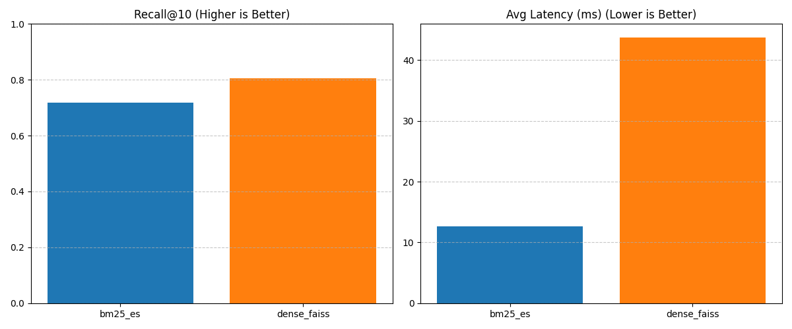

# search-retrieval-evaluation

Compare **BM25 (Elasticsearch)** vs **dense retrieval (SentenceTransformers + FAISS)** on a small public IR dataset, reporting **Recall@k** and **MRR** with reproducible runs and a CLI.

This repo is structured like a small production service/tooling project (clean modules, typed core code, tests, scripts), not a notebook-only demo.

## Methods

- **BM25**: Elasticsearch text indexing + `multi_match` queries over `title` and `text`.
- **Dense**: `sentence-transformers/all-MiniLM-L6-v2` embeddings + FAISS `IndexFlatIP` over L2-normalized vectors (cosine similarity).
- **Hybrid (RRF)**: Combines BM25 and Dense using Reciprocal Rank Fusion for best-of-both-worlds retrieval.

## Metrics

- **Recall@k**: Fraction of relevant documents retrieved in top-k
- **Precision@k**: Fraction of retrieved documents that are relevant
- **MRR@k**: Mean Reciprocal Rank - average of 1/rank for first relevant result
- **NDCG@k**: Normalized Discounted Cumulative Gain - position-aware relevance metric
- **Latency**: Average retrieval time per query (Python-side wall time)

All metrics computed for `k ∈ {1, 3, 5, 10}`.

## Dataset

Default dataset: **BEIR `scifact`** (small, includes corpus + queries + qrels).

The dataset is downloaded programmatically and cached under `./data/`:

- `corpus.jsonl`
- `queries.jsonl`
- `qrels/{split}.tsv`

## Local setup

Requirements:

- Python 3.11+
- Docker (for Elasticsearch)

```bash
cd search-retrieval-evaluation
python -m venv .venv
source .venv/bin/activate
pip install -r requirements.txt
pytest -q
```

## Run end-to-end

```bash
make up
make data
make index-bm25
make index-dense
make eval
```

Outputs:

- `reports/metrics.csv`
- `reports/metrics.json`
- `reports/summary.md`

You can also run the all-in-one helper:

```bash
./scripts/run_all.sh
```

## CLI examples

- Download dataset: `python -m src.data.download --dataset scifact --split test`
- Build BM25 index: `python -m src.retrieval.bm25_es --dataset scifact --split test --es_host http://localhost:9200 --index_name beir_scifact --recreate`
- Build dense index: `python -m src.retrieval.dense_faiss --dataset scifact --split test`
- Evaluate: `python -m src.eval.run_eval --method all --k 10 --limit_queries 200 --dataset scifact --split test --es_index beir_scifact`

## Tradeoffs and limitations

- Dense retrieval requires downloading a model checkpoint the first time you run it (network + disk).
- Elasticsearch configuration is minimal (single node, no auth); production deployments need security and tuning.
- Hybrid retrieval adds latency (runs both BM25 + Dense) but often improves accuracy.
- Adding a cross-encoder reranker on top of hybrid retrieval is a natural next step for even better results.

## Results Analysis

We evaluated **BM25** and **Dense Retrieval (FAISS)** on the SciFact dataset (test split, 200 queries).



| Method | Recall@10 | MRR@10 | Avg Latency (ms) |
| :--- | :--- | :--- | :--- |
| **BM25 (Elasticsearch)** | 0.717 | 0.540 | **~12.6ms** |
| **Dense (FAISS)** | **0.805** | **0.615** | ~43.8ms |

### Key Takeaways

1.  **Dense Retrieval Wins on Accuracy**: The dense retriever (using `all-MiniLM-L6-v2`) achieved significantly better Recall (+12%) and MRR (+14%) compared to BM25. This suggests that semantic matching captures relevant documents that lexical search misses.
2.  **BM25 Wins on Latency**: Elasticsearch BM25 is approximately **3.5x faster** than the unoptimized FAISS Flat index.
3.  **Trade-off**: For latency-critical applications, BM25 remains a strong baseline. For accuracy-critical tasks, dense retrieval is superior, though it incurs higher computational cost.
