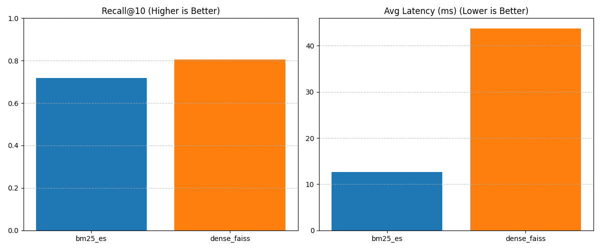

# Search & Retrieval Evaluation

Compare **BM25 (Elasticsearch)**, **Dense Retrieval (SentenceTransformers + FAISS)**, and **Hybrid (RRF)** on IR benchmarks with reproducible runs, typed Python modules, and automated metric reporting.

This project is structured like production tooling — clean modules, typed dataclasses, a `Retriever` protocol, and a full test suite — not a notebook-only demo.

## Architecture

```
┌──────────────────────────────────────────────────────────┐
│                     CLI / Makefile                        │
│  make data → make index-bm25 → make index-dense → eval   │
└──────────────────┬───────────────────────────────────────┘
                   │
        ┌──────────▼──────────┐
        │    Eval Runner      │
        │  (run_eval.py)      │
        │  - Sample queries   │
        │  - Time retrieval   │
        │  - Aggregate metrics│
        └─────┬───────┬───────┘
              │       │
    ┌─────────▼─┐   ┌─▼──────────┐   ┌──────────────┐
    │   BM25    │   │   Dense    │   │   Hybrid     │
    │Elasticsearch│  │   FAISS   │   │   (RRF)      │
    │multi_match │  │ IndexFlatIP│   │ Fuses both   │
    │title^2+text│  │ cosine sim │   │ rank-based   │
    └─────┬─────┘   └─────┬─────┘   └──────┬───────┘
          │               │                 │
          │  ┌────────────▼────────┐        │
          │  │ SentenceTransformer │        │
          │  │ all-MiniLM-L6-v2   │        │
          │  └─────────────────────┘        │
          │                                 │
    ┌─────▼─────────────────────────────────▼──┐
    │             Retriever Protocol            │
    │   retrieve(query, k) → [RetrievalResult] │
    └──────────────────────────────────────────┘
                        │
              ┌─────────▼─────────┐
              │   Metrics Engine   │
              │  Recall, Precision │
              │  MRR, NDCG @ k    │
              │  + Latency (ms)   │
              └─────────┬─────────┘
                        │
              ┌─────────▼─────────┐
              │  Reports (CSV,    │
              │  JSON, Markdown,  │
              │  PNG chart)       │
              └───────────────────┘
```

## Project Structure

```
search-retrieval-evaluation/
├── src/
│   ├── config.py                # Paths, dataset config, seed
│   ├── data/
│   │   ├── download.py          # BEIR dataset downloader
│   │   ├── preprocess.py        # Corpus/query loading
│   │   └── qrels.py             # Relevance judgments (TSV parser)
│   ├── retrieval/
│   │   ├── common.py            # Retriever protocol + RetrievalResult
│   │   ├── bm25_es.py           # Elasticsearch BM25 retriever
│   │   ├── dense_faiss.py       # FAISS dense retriever
│   │   └── hybrid.py            # Reciprocal Rank Fusion
│   ├── eval/
│   │   ├── metrics.py           # Recall, Precision, MRR, NDCG, DCG
│   │   ├── run_eval.py          # Evaluation orchestrator + CLI
│   │   └── visualize.py         # Matplotlib chart generation
│   └── utils/
│       ├── logging.py           # Structured logger
│       ├── io.py                # JSON/JSONL I/O helpers
│       └── seed.py              # Reproducibility seeding
├── tests/
│   ├── conftest.py              # Pytest configuration
│   ├── test_metrics.py          # Metric function unit tests
│   └── test_qrels.py            # Qrels parser tests
├── data/beir/scifact/           # Downloaded dataset (auto-cached)
├── reports/                     # Generated outputs
│   ├── metrics.csv
│   ├── metrics.json
│   ├── summary.md
│   └── metrics_comparison.png
├── scripts/
│   ├── setup.sh                 # Venv + deps + test runner
│   └── run_all.sh               # Full end-to-end pipeline
├── Makefile                     # Make targets for each step
├── docker-compose.yml           # Single-node Elasticsearch
└── requirements.txt
```

## Methods

| Method | Implementation | How It Works |
|--------|---------------|--------------|
| **BM25** | Elasticsearch 8.17 | `multi_match` over `title` (2x boost) and `text` fields |
| **Dense** | FAISS `IndexFlatIP` | `all-MiniLM-L6-v2` embeddings, L2-normalized for cosine similarity |
| **Hybrid (RRF)** | Reciprocal Rank Fusion | Combines BM25 + Dense ranks: `score = Σ(weight / (k + rank))` |

All three implement the `Retriever` protocol — a single `retrieve(query, k) → list[RetrievalResult]` interface.

## Metrics

All metrics computed for `k ∈ {1, 3, 5, 10}`:

| Metric | What It Measures |
|--------|-----------------|
| **Recall@k** | Fraction of relevant documents found in top-k |
| **Precision@k** | Fraction of top-k documents that are relevant |
| **MRR@k** | Mean Reciprocal Rank — 1/position of first relevant hit |
| **NDCG@k** | Position-aware relevance (rewards relevant docs ranked higher) |
| **Latency** | Average retrieval time per query (Python wall time) |

## Dataset

Default: **BEIR `scifact`** (scientific fact verification, 5K docs, 300 queries).

Downloaded programmatically and cached under `./data/beir/`:
- `corpus.jsonl` — documents with title + text
- `queries.jsonl` — natural language queries
- `qrels/{split}.tsv` — binary relevance judgments

## Quick Start

```bash
# Clone and setup
git clone https://github.com/DareDev256/vector-vs-keyword-search.git
cd vector-vs-keyword-search
python -m venv .venv && source .venv/bin/activate
pip install -r requirements.txt

# Run tests
pytest -q

# Full pipeline (requires Docker for Elasticsearch)
make up          # Start Elasticsearch
make data        # Download BEIR scifact
make index-bm25  # Build BM25 index
make index-dense # Build FAISS index
make eval        # Run evaluation
```

Or use the all-in-one script:
```bash
./scripts/run_all.sh
```

## CLI Examples

```bash
# Download dataset
python -m src.data.download --dataset scifact --split test

# Build BM25 index
python -m src.retrieval.bm25_es --dataset scifact --split test \
  --es_host http://localhost:9200 --index_name beir_scifact --recreate

# Build dense index
python -m src.retrieval.dense_faiss --dataset scifact --split test

# Evaluate all methods
python -m src.eval.run_eval --method all --k 10 --limit_queries 200 \
  --dataset scifact --split test --es_index beir_scifact

# Generate visualization
python -m src.eval.visualize --metrics_path reports/metrics.json
```

## Results

Evaluated on SciFact (test split, 200 queries, seed 42):



| Method | Recall@10 | MRR@10 | Avg Latency (ms) |
| :--- | :--- | :--- | :--- |
| **BM25 (Elasticsearch)** | 0.717 | 0.540 | **~12.6ms** |
| **Dense (FAISS)** | **0.805** | **0.615** | ~43.8ms |

### Key Takeaways

1. **Dense Retrieval Wins on Accuracy**: +12% Recall, +14% MRR over BM25. Semantic matching captures what lexical search misses.
2. **BM25 Wins on Latency**: ~3.5x faster than unoptimized FAISS flat search.
3. **Trade-off**: BM25 for latency-critical apps, dense for accuracy-critical tasks.
4. **Hybrid RRF**: Combines both methods via rank fusion — often the best of both worlds at the cost of running both retrievers.

## Trade-offs & Limitations

- Dense retrieval requires downloading the model checkpoint on first run (~90MB)
- Elasticsearch setup is minimal (single node, no auth) — production needs security and tuning
- Hybrid adds latency (runs both BM25 + Dense) but often improves accuracy
- Cross-encoder reranking on top of hybrid is a natural next step
- FAISS `IndexFlatIP` is exact search — for larger corpora, use `IndexIVFFlat` or HNSW

## Tech Stack

- **Python 3.11+** with type annotations throughout
- **Elasticsearch 8.17** via Docker Compose
- **FAISS** (Facebook AI Similarity Search)
- **SentenceTransformers** (`all-MiniLM-L6-v2`)
- **pandas** for metric aggregation
- **matplotlib** for visualization
- **pytest** for testing
